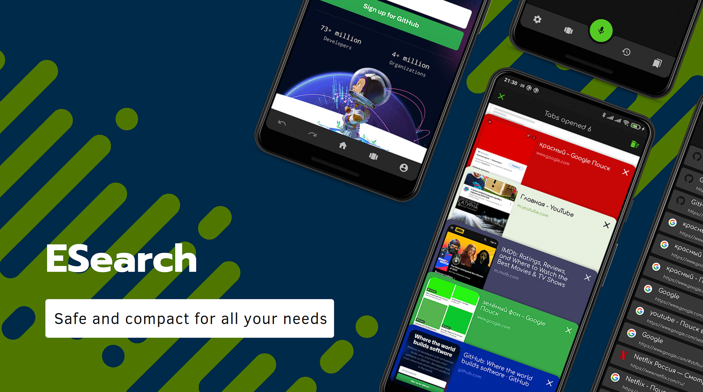

<h1 align="center">ESearch</h1>

<p align="center">
  <a href="https://opensource.org/licenses/Apache-2.0"></a>
  <a href="https://android-arsenal.com/api?level=21"></a>
  <a href="https://github.com/t8rin/FridgeXLight/actions"></a> 
  <a href="https://github.com/t8rin"></a> 
</p>

<p align="center">  
ESearch is a lightweight beatufull web browser based on android webview.<br>You can easily change the search engine during your query to find everything you need <br>Project includes DuckDuckGo seclusion scripts, DNT header, JavaScript disabling and another privacy settings. <br> Smart autoupdated built-in adblock silently removes all ads on the pages
</p>
</br>

<p align="center">

</p>

## Download
Go to the [Releases](https://github.com/t8rin/ESearch/releases) to download the latest APK.


## Tech stack & Open-source libraries
- Minimum SDK level 21

- [Kotlin](https://kotlinlang.org/) based 

- [Coroutines](https://github.com/Kotlin/kotlinx.coroutines) to work with internet and move tasks to a secondary thread

- JetPack
  - Room Persistence - construct the database using the abstract layer.
  - RecyclerView - for displaying large sets of data in UI while minimizing memory usage.
  - ViewBinding - convenient communication with xml layouts.
  - WebView - browser engine
  - Palette - to generate color palette based on bitmap
  - WebKit - modern WebView api

- [Glide](https://github.com/bumptech/glide) - loading images.

- [Material-Components](https://github.com/material-components/material-components-android) - Material design components like ripple animation, cardView.

- [Looping Layout](https://github.com/BeksOmega/looping-layout) - RecyclerView layout manager that provides infinite scroll in both directions

- [Scrolling Pager Indicator](https://github.com/Tinkoff/ScrollingPagerIndicator) - RecyclerView scroll pages indication


## MAD Score


# License
```xml
Designed and developed by 2021 T8RIN

Licensed under the Apache License, Version 2.0 (the "License");
you may not use this file except in compliance with the License.
You may obtain a copy of the License at

   http://www.apache.org/licenses/LICENSE-2.0

Unless required by applicable law or agreed to in writing, software
distributed under the License is distributed on an "AS IS" BASIS,
WITHOUT WARRANTIES OR CONDITIONS OF ANY KIND, either express or implied.
See the License for the specific language governing permissions and
limitations under the License.
```
